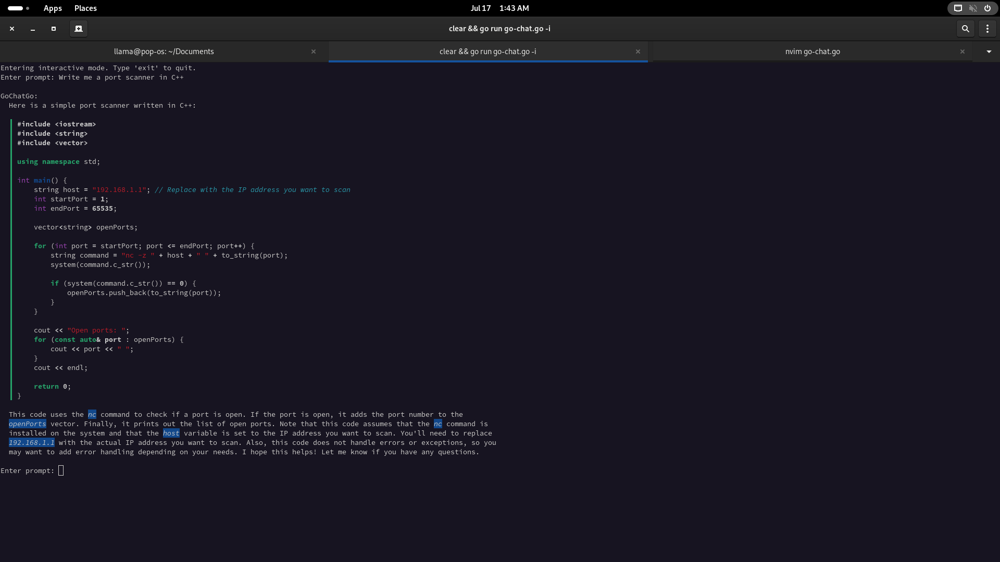
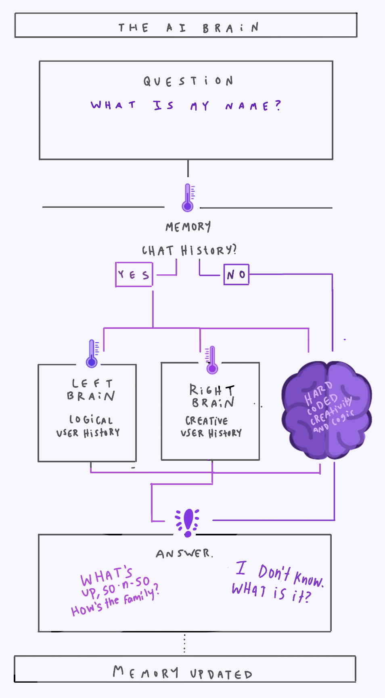

# Go Chat Go 

Welcome to GoChatGo! This command-line powerhouse uses the GPT (Generative Pre-trained Transformer) API to send chat prompts and receive dazzling responses. With its unique 4-model hive mind setup, GoChatGo brings you a blend of logic and creativity like never before. Perfect for the GNOME desktop environment, this tool is packed with features to make your AI interactions smooth and efficient.




## Features

- **4-Model Hive Mind**: GoChatGo employs a unique setup of four models:
  - **Left Brain**: Low temperature for logical, precise responses.
  - **Right Brain**: High temperature for creative, out-of-the-box replies.
  - **Executive Function**: Merges the data from both brains into a cohesive answer.
  - **History Summarizer**: Serves as memory for the hive mind by summarizing history and determining the mood of the conversation.
- **File Uploads**: Seamlessly upload text and code files to be used as chat prompts.
- **Send Chat Prompts**: Engage with any GPT-compatible API to send prompts and get responses.
- **Log Conversations**: Keep track of your chats with automatic logging for the past two days.
- **Run as a Daemon**: Run GoChatGo in the background, with periodic check-ins if you're slacking off.
- **Notifications**: Get notified on your GNOME desktop when running as a daemon.
- **Interactive Mode**: Dive into an interactive mode for continuous chat exchanges.
- **Custom Prompts**: Set a default prompt to be included with every chat request.
- **Toggle Check-In**: Easily enable or disable the periodic check-in feature.

## Installation

1. **Install Go**: Make sure Go is installed on your system. If not, follow the installation instructions at [golang.org](https://golang.org/doc/install).
2. **Clone the Repository**: Clone this repository to your local machine:
    ```sh
    git clone https://github.com/YourUsername/GoChatGo.git
    ```
3. **Run the install script**: Navigate to the GoChatGo directory and run the install script to set up the application and dependencies:
    ```sh
    cd GoChatGo
    ./install.sh
    ```

### Notes
- GoChatGo is optimized for GNOME desktop environments. On other desktops, notifications might play hide and seek.
- If you're not on Linux, you'll need to manually move the binary into your path. 

Get ready to chat like never before with GoChatGo! Your AI assistant is just a command away.

